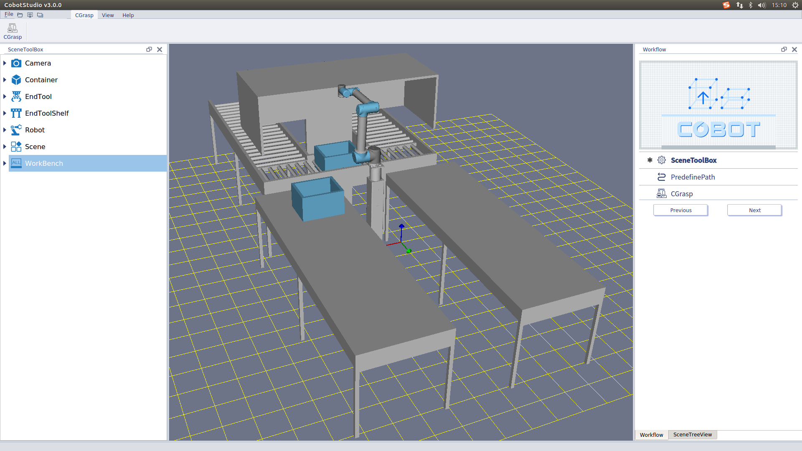

### Cobotsys 3.0 使用教程

#### 简介

Cobotsys 3.0是[武汉库柏特科技有限公司](http://www.cobotsys.com/)发布的智能机器人操作系统，旨在实现可面向复杂应用场景和缺失硬件环境的快速构建和开发，让服务和插件可自由组合成完整的解决方案。目前支持的平台为Ubuntu16.04、Ubuntu18.04。

#### 资源下载

- [软件安装包下载地址](https://github.com/COBOTOS/CobotSys/releases)
- [安装说明](https://github.com/COBOTOS/CobotSys/blob/master/cobotsys_tutorials/README.md)
- [例程](https://github.com/COBOTOS/CobotSys/tree/master/cobotsys_tutorials/examples)
- [更丰富的内容](http://bbs.cobotsys.com/)

#### 问题反馈
欢迎到[issue](https://github.com/COBOTOS/CobotSys/issues "With a Title")里面提问，期待各位的反馈。

