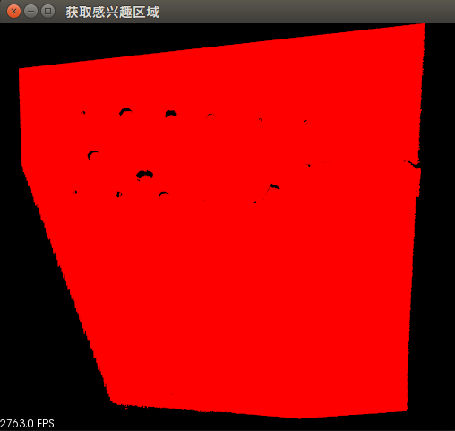
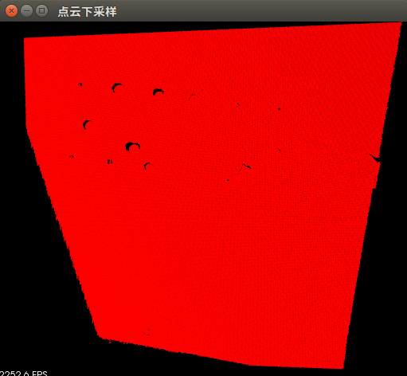
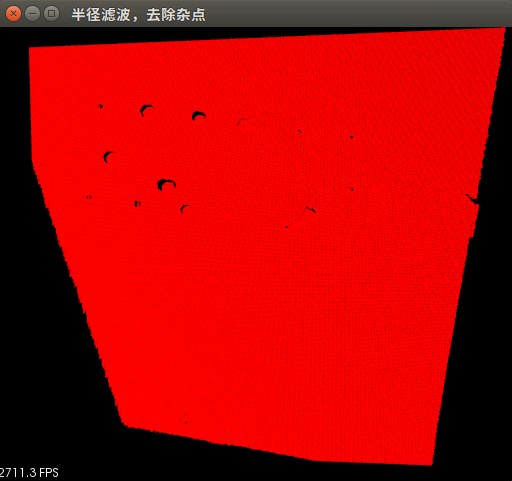
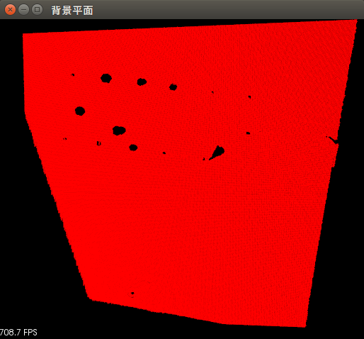
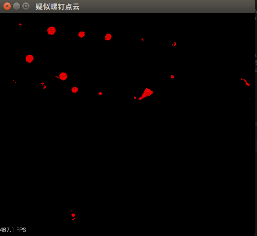
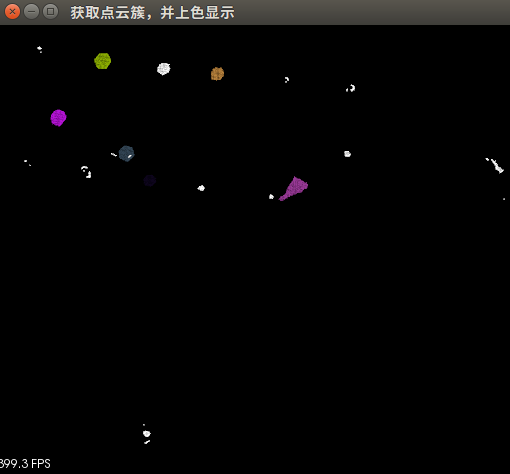
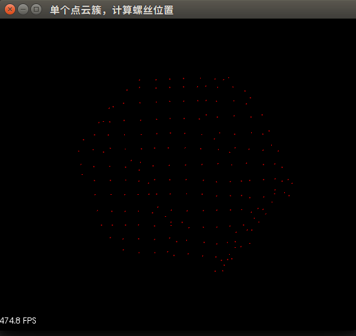
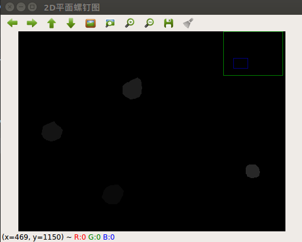
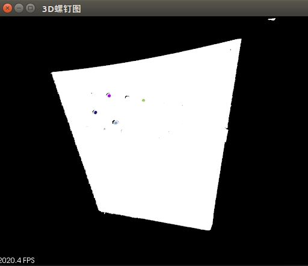

# 螺钉检测例程详解
- 功能:获取螺丝位置与法向
- testScrewDetector例程输入点云为带有螺丝的点云图
- testScrewDetectorComatrix例程输入为Comatrix相机
- 螺钉检测算法参数需要根据相机型号

## 算法步骤解析
运行testScrewDetector例程后，点击"q"键，以顺序播放如下图片(算法):

1、获取感兴趣区域  
即获取相机捕获的点云图

2、点云下采样  
压缩点云数据量

3、半径滤波，去除杂点  
去除下采样后点云存在的部分杂点

4、半径滤波，去除杂点  
去除下采样后点云存在的部分杂点

5、背景平面    
去除疑似螺钉点云，留下背景平面点云

6、疑似螺钉点云    
去除背景平面点云，留下疑似螺钉点云

7、获取点云簇并上色显示  
以点云簇为单位，截取所有疑似螺钉点云图中的螺钉

8、单个点云簇计算螺丝位置  
列出所有截取的螺钉位置

9、2D平面螺钉图  
在Comatrix相机获得的2D平面图上附上检测到的螺钉位置

10、3D螺钉图  
在空间中显示检测到的螺钉位置，并用原球圆心表示螺钉表面圆心

